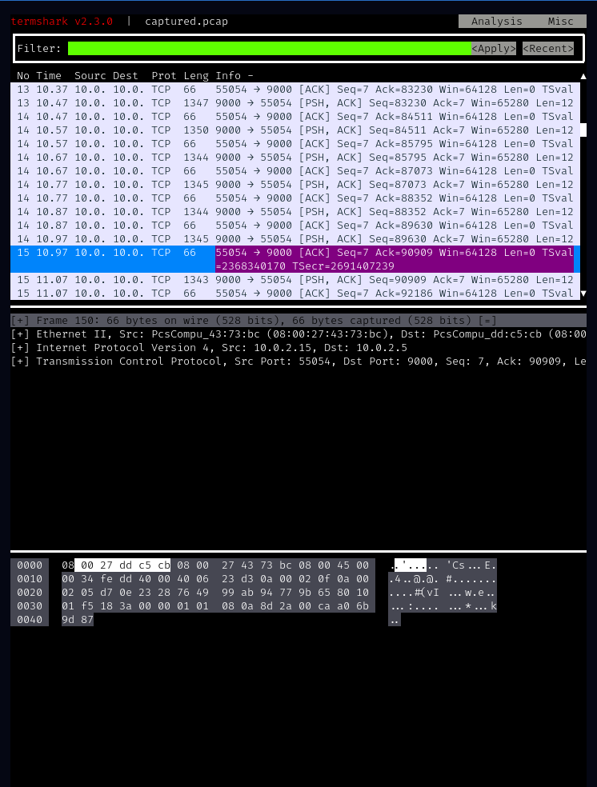

# XMAS CTF 2021
This capture the flag competition was the first I ever competed in (in 2020), and contains some of the most creative and varied challenges I've seen thus far. I competed individually and had other commitments during the competition times, so I didn't invest as much time as I would have liked, however the experience was still quite entertaining and educational.

## Discord
### Sanity Check
The `Sanity Check` flag in the discord was hidden in the `#general` channel's description (as it was last year). People have a surprisingly hard time finding this, overthinking and believing it has something to do with a bot, which created quite a bit of spam in the channels (something the hosts might benefit from mitigating in subsequent years).

### Bot
Upon seeing the `Mem-X` challenge, I tentatively identified as based on a file inclusion vulnerability, and proceeded as such. The basis of the challenge was bot functionality to make notes using the `!note [name of note]` command, which returned a hash of the note. The user could then read the note by passing the hash to the `!remember` command. 

After playing with different parameters, trying variations of `flag.txt` (`!note flag.txt`, `!note ../flag.txt`, `!note flag`) and using the received hashes as parameters to `!remember`, I realised I may have been going about this the wrong way. I considered that the notes may have been saved with their hashes as filenames and tried `!remember flag`, receiving "We couldn't find a note called `flag.txt`". I then sent `!remember /flag` and received the flag! `X-MAS{f0rgEtt1nG_EvEry7h1Ng_abf91b10e019c}`


## Bioinformatics
### Having a BLAST
Given a DNA sequence of an enzyme, the goal was to find the enzyme encoded.

```
CGCTTCCTCCCCAAATTGCTCAGCGCCACCGGTATGCAGGGGCCAGCGGGCAGCGGCTGGGAGGAGGGGAGTGGGAGCCCGCCAGGTGTAACCCCTCTCTTCTCCCCCTAGCCTCGGAGGCTCCCAGCACCTGCCCAGGCTTCACCCATGGGGAGGCTGCTCGGAGGCCCGGCCTCCCCCTGCCCCTCCTCCTCCTCCACCAGCTTCTCCTCCTCTTCCTCTCCCACCTCCGGCGGCTGTGAACACGGCCTCTTCCCCTACGGCCACAGGGGCCCCTCCTCTAATGAGTGGTCGGACCGTGGGGAAGGGCCCCACTCAGGGATCTCAGACCTAGTGCTCCCTTCCTCCTCAAACCGAGAGACTCACACTGGACAGGGCAGGAGGAGGGGGCCGTGCCTCCCACCCTTCTCAGGGACCCCCACGCCTTTGTTGTTTGAATGGAAATGGAAAAGCCAGTATTCTTTTTATAAAATTATCTTTTTGGAACCTGAGCCTGACATTGGGGGGAAGTGGGAGGCCGGACGGGTAGCACCCC
```
My first approach was plain OSINT, and after looking through search results and databases ([far](https://pubmed.ncbi.nlm.nih.gov/?sort=date&term=CGCTTCCTCCCCAAATTGCTCAGCGCCACCGGTATGCAGGGGCCAGCGGGCAGCGGCTGGGAGGAGGGGAGTGGGAGCCCGCCAGGTGTAACCCCTCTCTTCTCCCCCTAGCCTCGGAGGCTCCCAGCACCTGCCCAGGCTTCACCCATGGGGAGGCTGCTCGGAGGCCCGGCCTCCCCCTGCCCCTCCTCCTCCTCCACCAGCTTCTCCTCCTCTTCCTCTCCCACCTCCGGCGGCTGTGAACACGGCCTCTTCCCCTACGGCCACAGGGGCCCCTCCTCTAATGAGTGGTCGGACCGTGGGGAAGGGCCCCACTCAGGGATCTCAGACCTAGTGCTCCCTTCCTCCTCAAACCGAGAGACTCACACTGGACAGGGCAGGAGGAGGGGGCCGTGCCTCCCACCCTTCTCAGGGACCCCCACGCCTTTGTTGTTTGAATGGAAATGGAAAAGCCAGTATTCTTTTTATAAAATTATCTTTTTGGAACCTGAGCCTGACATTGGGGGGAAGTGGGAGGCCGGACGGGTAGCACCCC) [too](https://www.brenda-enzymes.org/fulltext.php?Searchterm=CGCTTCCTCCCCAAATTGCTCAGCGCCACCGGTATGCAGGGGCCAGCGGGCAGCGGCTGGGAGGAGGGGAGTGGGAGCCCGCCAGGTGTAACCCCTCTCTTCTCCCCCTAGCCTCGGAGGCTCCCAGCACCTGCCCAGGCTTCACCCATGGGGAGGCTGCTCGGAGGCCCGGCCTCCCCCTGCCCCTCCTCCTCCTCCACCAGCTTCTCCTCCTCTTCCTCTCCCACCTCCGGCGGCTGTGAACACGGCCTCTTCCCCTACGGCCACAGGGGCCCCTCCTCTAATGAGTGGTCGGACCGTGGGGAAGGGCCCCACTCAGGGATCTCAGACCTAGTGCTCCCTTCCTCCTCAAACCGAGAGACTCACACTGGACAGGGCAGGAGGAGGGGGCCGTGCCTCCCACCCTTCTCAGGGACCCCCACGCCTTTGTTGTTTGAATGGAAATGGAAAAGCCAGTATTCTTTTTATAAAATTATCTTTTTGGAACCTGAGCCTGACATTGGGGGGAAGTGGGAGGCCGGACGGGTAGCACCCC&stype=2&compl_db=on&tables%5B%5D=1&tables%5B%5D=32&tables%5B%5D=2&tables%5B%5D=3&tables%5B%5D=4&tables%5B%5D=48&tables%5B%5D=5&tables%5B%5D=6&tables%5B%5D=7&tables%5B%5D=8&tables%5B%5D=9&tables%5B%5D=301&tables%5B%5D=302&tables%5B%5D=10&tables%5B%5D=54&tables%5B%5D=11&tables%5B%5D=305&tables%5B%5D=55&tables%5B%5D=49&tables%5B%5D=12&tables%5B%5D=13&tables%5B%5D=14&tables%5B%5D=15&tables%5B%5D=16&tables%5B%5D=51&tables%5B%5D=50&tables%5B%5D=17&tables%5B%5D=19&tables%5B%5D=20&tables%5B%5D=21&tables%5B%5D=22&tables%5B%5D=23&tables%5B%5D=45&tables%5B%5D=46&tables%5B%5D=47&tables%5B%5D=53&tables%5B%5D=24&tables%5B%5D=25&tables%5B%5D=26&tables%5B%5D=27&tables%5B%5D=28&tables%5B%5D=29&tables%5B%5D=30&tables%5B%5D=31&tables%5B%5D=33&tables%5B%5D=34&tables%5B%5D=35&tables%5B%5D=36&tables%5B%5D=37&tables%5B%5D=38&tables%5B%5D=39&tables%5B%5D=40&tables%5B%5D=41&tables%5B%5D=42&tables%5B%5D=43&tables%5B%5D=44&tables%5B%5D=100) [many](https://rnacentral.org/rna/URS00001A964C/1198627) databases), I reread the challenge title and focused on the [EMBL-EBI BLAST](https://www.ebi.ac.uk/Tools/sss/ncbiblast/) database. After looking around the website for a bit, I ended up just querying all of the relevant databases and after around 15 minutes of "panicking" that the query would take days, I got a match, receiving my flag: `X-MAS{acetylcholinesterase}`.

### A Putative Sequence
The request in this challenge was to find spike glycoprotein (as a polypeptide) from the SARS‑CoV‑2 B.1.617.1 lineage, not including the stop codon. This was done with more OSINT (I see why it's called bioinformatics now), initially with the website of [European Centers of Disease Control](https://www.ecdc.europa.eu/en/covid-19/variants-concern), then to pleasantly reliable [wikipedia](https://en.wikipedia.org/wiki/SARS-CoV-2_Kappa_variant). From there I recovered the main mutations: 
`L452R`, `D614G`, `P681R`, `E154K`, `Q1071H` and `E484Q`. I then had to painfully try to figure out how to apply them manually (I found [this](http://www.hgmd.cf.ac.uk/docs/mut_nom.html) site useful). By manually I mean in a python3 REPL using string indices...

After doing that, I submitted the flag. FAIL. Turns out I was missing some mutations (`G142D` and `T95I`), using the right column of the below wikipedia table, which was missing the mutations shown in the [stanford-sourced visualisation](https://covdb.stanford.edu/page/mutation-viewer/#sec_kappa).

|        | Nucleotide | Amino acid |
|--------|------------|------------|
| Spike  |   T21895C  |     -      |
|        |   T21895C  |   E154K    |
|        |   T22917G  |   L452R    |
|        |   G23012C  |   E484Q    |
|        |            |   D614G    |
|        |   C23604G  |   P681R    |
|        |            |   Q1071H   |


After finally getting all 8 mutations and substituting them into the given amino acid, I was left with the flag:

```
X-MAS{
MFVFLVLLPLVSSQCVNLTTRTQLPPAYTNSFTRGVYYPDKVFRSSVLHSTQDLFLPFFSNVT
WFHAIHVSGTNGTKRFDNPVLPFNDGVYFASIEKSNIIRGWIFGTTLDSKTQSLLIVNNATNV
VIKVCEFQFCNDPFLDVYYHKNNKSWMKSEFRVYSSANNCTFEYVSQPFLMDLEGKQGNFKNL
REFVFKNIDGYFKIYSKHTPINLVRDLPQGFSALEPLVDLPIGINITRFQTLLALHRSYLTPG
DSSSGWTAGAAAYYVGYLQPRTFLLKYNENGTITDAVDCALDPLSETKCTLKSFTVEKGIYQT
SNFRVQPTESIVRFPNITNLCPFGEVFNATRFASVYAWNRKRISNCVADYSVLYNSASFSTFK
CYGVSPTKLNDLCFTNVYADSFVIRGDEVRQIAPGQTGKIADYNYKLPDDFTGCVIAWNSNNL
DSKVGGNYNYRYRLFRKSNLKPFERDISTEIYQAGSTPCNGVQGFNCYFPLQSYGFQPTNGVG
YQPYRVVVLSFELLHAPATVCGPKKSTNLVKNKCVNFNFNGLTGTGVLTESNKKFLPFQQFGR
DIADTTDAVRDPQTLEILDITPCSFGGVSVITPGTNTSNQVAVLYQGVNCTEVPVAIHADQLT
PTWRVYSTGSNVFQTRAGCLIGAEHVNNSYECDIPIGAGICASYQTQTNSRRRARSVASQSII
AYTMSLGAENSVAYSNNSIAIPTNFTISVTTEILPVSMTKTSVDCTMYICGDSTECSNLLLQY
GSFCTQLNRALTGIAVEQDKNTQEVFAQVKQIYKTPPIKDFGGFNFSQILPDPSKPSKRSFIE
DLLFNKVTLADAGFIKQYGDCLGDIAARDLICAQKFNGLTVLPPLLTDEMIAQYTSALLAGTI
TSGWTFGAGAALQIPFAMQMAYRFNGIGVTQNVLYENQKLIANQFNSAIGKIQDSLSSTASAL
GKLQDVVNQNAQALNTLVKQLSSNFGAISSVLNDILSRLDKVEAEVQIDRLITGRLQSLQTYV
TQQLIRAAEIRASANLAATKMSECVLGQSKRVDFCGKGYHLMSFPQSAPHGVVFLHVTYVPAH
EKNFTTAPAICHDGKAHFPREGVFVSNGTHWFVTQRNFYEPQIITTDNTFVSGNCDVVIGIVN
NTVYDPLQPELDSFKEELDKYFKNHTSPDVDLGDISGINASVVNIQKEIDRLNEVAKNLNESL
IDLQELGKYEQYIKWPWYIWLGFIAGLIAIVMVTIMLCCMTSCCSCLKGCCSCGSCCKFDEDD
SEPVLKGVKLHYT}
```
## Forensics
Given a pcap, find the flag. Pretty typical forensics challenge, honestly. I opened the pcap in termshark (I like minimalism and terminal apps and in this case wasn't sacrificing functionality), and did a quick search for `X-MAS{` because sometimes it's that easy. Spoiler: this time it wasn't. 



So I conducted a somewhat deeper (but still quite shallow) analysis, noting that the pcap consited of a TCP stream between 2 IPs, and that there was no readable ascii. I decided to try reading the pcap without termshark (so that certain parts aren't hidden by text encoding and the program deciding whether or not it wants to show me data - I wanted more control), so I ran it through `strings`, redirecting into a file which I scrolled through quickly to see if there was anything suspicious (doing some cleanup of duplicate lines as well)... and there was in fact something.

At the very end of the file, a few lines caught my eye
```
[12;1HPlease enter the flag fragment (flagment) to continue (10/10). 
Your hint is "ef" >> 
#(vI
#(vI
|S@vI
Thank you!
You sent: ###################### (redacted for security reasons).
Goodbye.
```
Through a quick search of `/10)` I found the rest of the fragments, and was left with this:
```
[12;1HPlease enter the flag fragment (flagment) to continue (1/10). 
Your hint is "X-" >> z
[12;1HPlease enter the flag fragment (flagment) to continue (2/10). 
Your hint is "AS" >>
[12;1HPlease enter the flag fragment (flagment) to continue (3/10). 
Your hint is "u_" >>
[12;1HPlease enter the flag fragment (flagment) to continue (4/10). 
Your hint is "K4" >>
[12;1HPlease enter the flag fragment (flagment) to continue (5/10). 
Your hint is "th" >>
[12;1HPlease enter the flag fragment (flagment) to continue (6/10). 
Your hint is "d3" >>
[12;1HPlease enter the flag fragment (flagment) to continue (7/10). 
Your hint is "af" >>
[12;1HPlease enter the flag fragment (flagment) to continue (8/10). 
Your hint is "03" >>
[12;1HPlease enter the flag fragment (flagment) to continue (9/10). 
Your hint is "81" >>
[12;1HPlease enter the flag fragment (flagment) to continue (10/10). 
Your hint is "ef" >>
```

Putting that data together left me with an incomplete string that didn't appear to match up with the supposed length of the flag (from `You sent: ######################`). I knew I was missing something, but I wasn't sure what.
```
## ## ## ## ## ## ## ## ## ## ##
X- AS u_ K4 th d3 af 03 81 ef
```
After some head-banging-on-my-desk, I realised my lack of characters could have been caused by encoding issues (sigh) so I tried various ways of recovering data (cyberchef, hexed.it, file) but they all failed. I'm fairly certain there were intended to be pieces of data following the `>>` in the capture, but I couldn't seem to get them to present as anything useful so /shrug. This challenge was unnecessarily painful for me so I tried not to waste too much time on it, which brings me to my favorite problem, one that had me thinking about design and math and o-notation ... programming!

## Programming


