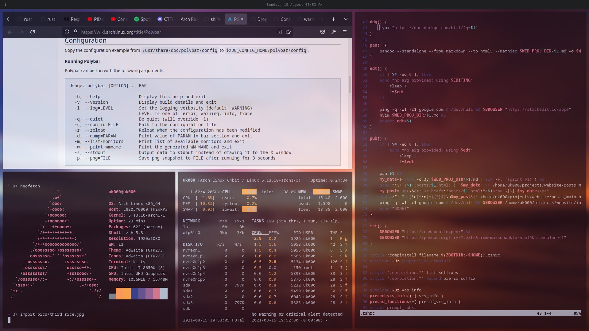
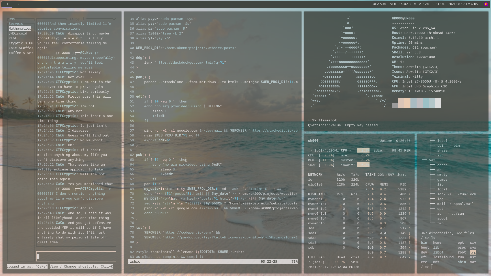
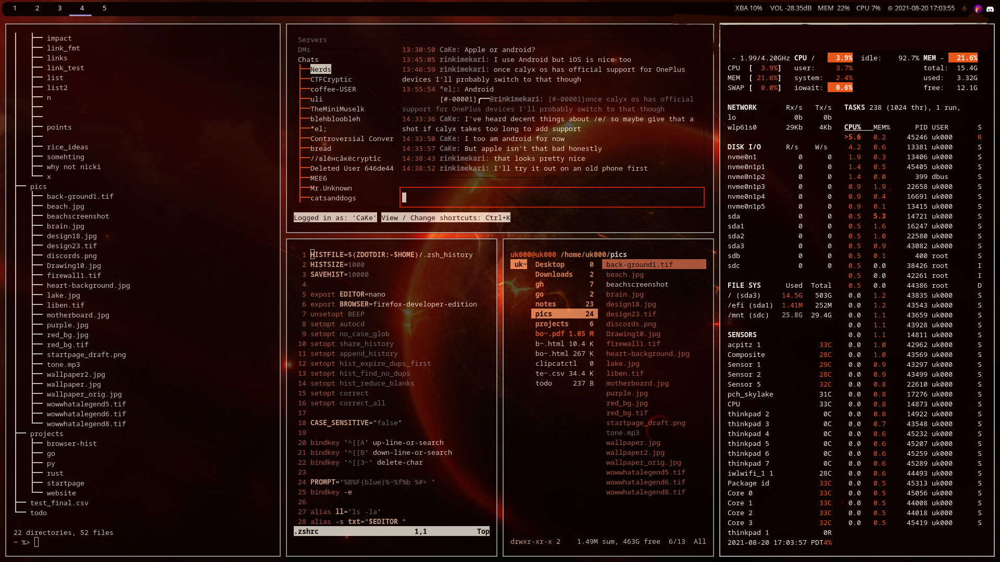

## An Evolution in Arch Linux Ricing
Ricing is defined as

> Increasing the perceived performance of something through cosmetics

It's a rather large subculture and people enjoy showing off their creations in places such as [r/unixporn](https://www.reddit.com/r/unixporn/)

Here are my attempts at ricing (live page, subject to updates as I improve)

---

