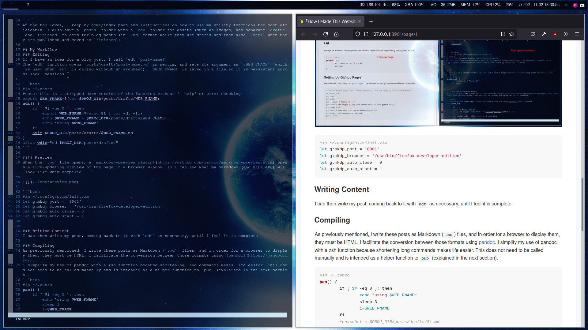

# How I Write These Posts
Recently I took it upon myself to finally bother to fully create a blog, after some failed attempts. I didn't particularly like the idea of using a noob-targeting website builder such as Wix and while a more developer-focused builder (such as Hugo) was preferable [I hosted a few pages on one for a while], I disliked the lack of control and transparency I had. I wanted *full* control. So I made my own buildsystem with a few bash/zsh scripts and neovim. It is 40 lines of easily understandable and hackable shell script, that has been put through enough troubleshooting to be robust enough for reasonable personal use. 

#### What I learned
- When testing shell scripts, don't put them directly into `~/.zshrc` without testing since editing them on and off from there is a waste of time
- Comment liberally, and add help commands since forgeting the use of utility scripts is not uncommon
- When creating projects for personal use, don't disregard normal programming customs. Keep everything organized. Shoddy code when prototyping creates problems later on
- Projects tend to considerably more time and unprecendented troubleshooting than originally expected
- Sometimes tradeoffs need to be made between "best practice" and "it works well enough" as time and effort spent on perfectionism doesn't always pay off

# Technical Info: Buildsystem
## File Tree Structure
```
├── index.html
├── index.md
├── posts
│   ├── cdn
│   │   ├── fifth_rice.png
│   │   ├── first_rice.jpg
│   │   ├── fourth_rice.jpg
│   │   ├── second_rice.jpg
│   │   └── third_rice.jpg
│   ├── drafts
│   │   ├── first_post.md
│   │   ├── How I Made This Website.md
│   │   ├── second.md
│   │   └── third.md
│   ├── finished
│   │   ├── Arch Ricing.html
│   │   └── Arch Ricing.md
│   ├── posts_main.html
│   └── posts_main.md
└── README.md 
```
At the top level, I keep my home/index page and instructions on how to use my utility functions the most efficiently. I also have a `posts` folder with a `cdn` folder for assets (such as images) and separate `drafts` and `finished` folders for blog posts (in `.md` format while they are drafts and then also	`.html` when they are published and moved to `finished`).

## My Workflow
### Editing
If I have an idea for a blog post, I call `edt [post-name]`
The `edt function` opens `posts\drafts\post-name.md` in neovim, and optionally allows you to not provide an argument and open the most recently edited file.

```bash
#in ~/.zshrc
#note: this is a stripped down version of the function without '--help' or error checking
export WEB_FNAME=$(cat $PROJ_DIR/posts/drafts/WEB_FNAME)
edt() {
	if [ $# -ne 0 ]; then
		export WEB_FNAME=$(echo $1 | cut -d. -f1)
		echo $WEB_FNAME > $PROJ_DIR/posts/drafts/WEB_FNAME
		echo "using $WEB_FNAME"
	fi
    nvim $PROJ_DIR/posts/drafts/$WEB_FNAME.md
}
alias wdir="cd $PROJ_DIR/posts/drafts/"
```

#### Preview
When the `.md` file opens, a [markdown-preview plugin](https://github.com/iamcco/markdown-preview.nvim) opens a live-updating preview of the page in a browser window, so I can see what my markdown (and $\LaTeX$) will look like when compiled.



```bash
#in ~/.config/nvim/init.vim
let g:mkdp_port = '8901'
let g:mkdp_browser = '/usr/bin/firefox-developer-edition'
let g:mkdp_auto_close = 0
let g:mkdp_auto_start = 1
```

### Writing Content
I can then write my post, coming back to it with `edt` as necessary, until I feel it is complete.

### Compiling
As previously mentioned, I write these posts as Markdown (`.md`) files, and in order for a browser to display them, they must be HTML. I facilitate the conversion between those formats using [pandoc](https://pandoc.org/). 
I simplify my use of pandoc with a zsh function because shortening long commands makes life easier. This does not need to be called manually and is intended as a helper function to `pub` (explained in the next section).
```bash
#in ~/.zshrc
pan() {
	if [ $# -eq 0 ]; then
		echo "using $WEB_FNAME"
		sleep 3
		1=$WEB_FNAME
	fi
	#envsubst < $PROJ_DIR/posts/drafts/$1.md
	pandoc --standalone --from markdown --to html5 --mathjax $PROJ_DIR/posts/drafts/$1.md -o $PROJ_DIR/posts/finished/$1.html
	firefox-developer-edition $PROJ_DIR/posts/finished/$WEB_FNAME.html
}
```
### Linking
The final step in the blogging process involves relabelling my post as a finished product (up until now it was a draft) and making it accessible from a `main_posts` page in the index ("home page") of my website. This is done through another zsh function: `pub`.

```bash
#in ~/.zshrc
pub() {
	if [ $# -eq 0 ]; then
		echo "no arg provided: using $WEB_FNAME"
	else
		WEB_FNAME=$1
	fi
	pan
	my_date=$(stat -c %y $PROJ_DIR/posts/finished/$WEB_FNAME.html | awk -F. '{print $WEB_FNAME}') &&
	#probably could be cleaned up but it works
	echo "\\> [$WEB_FNAME](finished/$WEB_FNAME.html) || $my_date" >> $PROJ_DIR/posts_main.md &&
	my_post="<p>\&gt; <a href=\"finished/$WEB_FNAME.html\">$WEB_FNAME</a> \|\| $my_date</p>"
		sed -zEi "s|(\n[^\n]*){3}$|\n$my_post&|" $PROJ_DIR/posts_main.html
		mv $PROJ_DIR/posts/drafts/$WEB_FNAME.md $PROJ_DIR/posts/finished/$WEB_FNAME.md
	fi
	pushpost()
}
```

```markdown
<!--- in $PROJ_DIR/posts/posts_main.md --->
# Posts:
<!--- The following entries are autogenerated--->
<!--- [post-name](relative-post-location) || last-modified-date-of-post-in-"yyyy-mm-dd hh-mm-ss"--->
\> [Example Post](posts/finished/Example\ Post.html) || 2021-01-01 13:37:37
```


## Git
I use git as a version control system, and I have a helper function to push blog posts (called in `pub`)
```bash
#in ~/.zshrc
pushpost() {
	git commit -a -m "Wrote $1"
	git push
}
```

### Setting Up Git(hub Pages)
My site is (for now) hosted on [github pages](https://docs.github.com/en/pages/getting-started-with-github-pages/about-github-pages). That was set up through the below series of commands.

```bash
# create github pages repo (named username.github.io) using github's web interface
cd $PROJ_DIR
git init
git add .
git commit -m "added files"
git remote add origin git@github.com:belkarx/belkarx.github.io.git
git remote -v
git pull origin main --allow-unrelated-histories
git push --set-upstream origin main
git status
```
